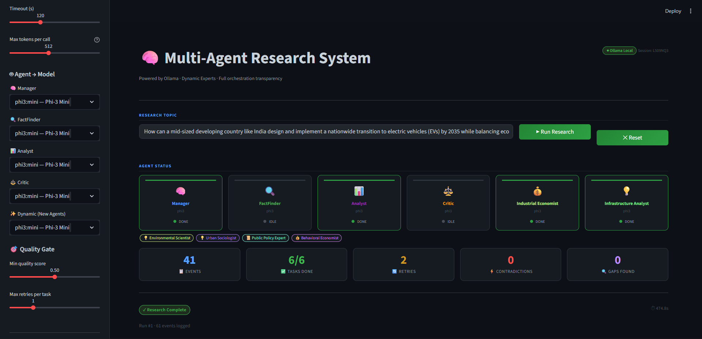
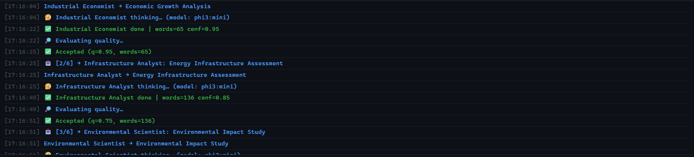
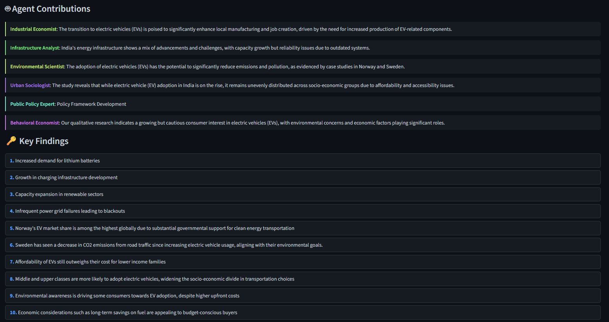
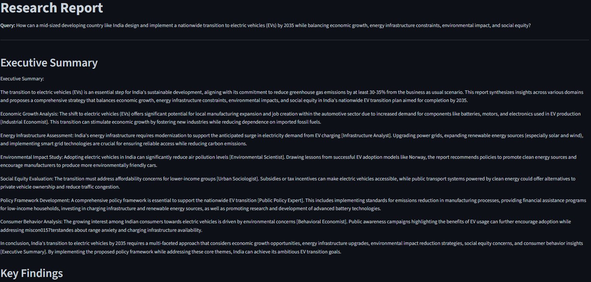

# 🧠 Multi-Agent Research & Report Generator (MAR System)

## 🚀 Overview

The **Multi-Agent Research System (MAR)** is designed to solve complex research queries through coordinated collaboration between multiple AI agents.

A central **Manager Agent** orchestrates specialized **Worker Agents** to decompose tasks, execute them, evaluate outputs, and generate a structured, high-quality report.

### ✨ Core Capabilities

* Fully **local execution using Ollama** (no external APIs)
* **Dynamic task decomposition & Persona Generation**
* **Active Conflict Resolution & Gap Filling**
* **Intelligent retry and reassignment**
* **Retrieval-Augmented Generation (Local RAG)**
* Optional **web scraping via Firecrawl/BS4**
* **Transparent execution logs**
* Interactive **Streamlit UI**

---

## 🎯 Objective

This system:
* Accepts a **complex research query**
* Breaks it into **smaller domain-specific subtasks**
* Invents and assigns tasks to **specialized dynamic agents**
* Evaluates outputs for quality (Quality Gate)
* Handles failures via **retry and reassignment**
* Resolves factual contradictions between agents
* Produces a **coherent structured Markdown report**
---

## 🏗️ System Architecture

```
USER INTERFACE (Streamlit)
    |
    v  (Query + Files + URLs)

RESEARCH PIPELINE (Background Thread)
    |
    |---- 1. DATA INGESTION PHASE
    |         |
    |         |---- Web Scraper (Firecrawl API / BS4)
    |         |---- Local File Parser (PDF / TXT / DOCX)
    |         |
    |         ---> Document Chunker
    |                   |
    |                   v
    |            Ollama Embeddings
    |                   |
    |                   v
    |            ChromaDB Vector Store
    |
    |---- 2. ORCHESTRATION PHASE
              |
              v
        Manager Agent (LLaMA 3)
              |
              |---- Assess Complexity (1–5 Tasks)
              |---- Plan & Invent Roles (e.g., MarineBiologist)
              |
              |---- 3. EXECUTION PHASE (Parallel / Sequential)
              |         |
              |         |---- Worker 1 <---- Queries ---- ChromaDB
              |         |---- Worker 2 <---- Queries ---- ChromaDB
              |         |---- Worker N <---- Queries ---- ChromaDB
              |
              |---- 4. QUALITY & CONSENSUS PHASE
              |         |
              |         |---- Quality Gate (Pass / Fail / Retry)
              |         |---- Gap Filler (FactFinder)
              |         |---- Conflict Resolution
              |
              |---- 5. SYNTHESIS PHASE
                        |
                        |---- Draft Domain Sections
                        |---- Draft Executive Summary
                        |---- Draft Conclusion
                        |
                        v
                Final Markdown Report
                        |
                        v
                Sent back to Streamlit UI
```
---
### 🧠 Manager Agent

Responsible for:

* Task decomposition and complexity classification
* Dynamic agent persona creation
* Agent assignment and routing
* Quality evaluation (scoring worker outputs)
* Active Conflict Resolution (detecting and resolving contradictory findings)
* Final cohesive synthesis

---

### 🤖 Worker Agents

| Agent          | Role                                                         |
| -------------- | ------------------------------------------------------------ |
| **Dynamic Specialists** | Agents invented on the fly by the Manager based on the specific query (e.g., UrbanPlanner, BehavioralEconomist).|
| **FactFinder**    | Core fallback agent. Retrieves verifiable facts, statistics, and concrete data.|
| **Analyst**     | Core fallback agent. Identifies trends, patterns, and strategic insights.|
| **Critic**     | Core fallback agent. Evaluates risks, counterarguments, and limitations.|

---


## 🔁 Orchestration Flow

```
User Query
   ↓
Manager Agent
   ↓
Task Decomposition
   ↓
Task Classification
   ↓
Agent Delegation
   ↓
Worker Execution
   ↓
Quality Evaluation
   ↓
Retry / Reassign (if needed)
   ↓
Final Synthesis
   ↓
Structured Report
```

---

## ⚙️ Key Features

### ✅ 1. Dynamic Task Decomposition

* Adapts the number of tasks based on query complexity.
* Manager dynamically invents custom specialist personas perfectly suited to the sub-domains.

---

### ✅ 2. Intelligent Orchestration & Self-Healing

* Quality Gate: Strict grading of agent outputs.
* Automatic Retries: Tasks that fail the quality threshold are reassigned to core agents.
* Gap Filling: If a task completely fails, a FactFinder is spun up to fill the missing data hole.

---

### ✅ 3. Fully Local LLMs (Ollama)

* No dependency on external APIs (100% private).
* Runs entirely on local hardware using models like llama3:8b, mistral:7b, and phi3:mini.

---

### ✅ 4. Retrieval-Augmented Generation (RAG)

* UI-based drag-and-drop document ingestion (PDF, TXT, DOCX).
* Local ChromaDB vector store using local Nomic embeddings.
* Strict prompt enforcement preventing agents from hallucinating outside the RAG context.
* Web Scraping Integration

---

### ✅ 5. Active Conflict Resolution

The Manager cross-references all agent outputs before synthesis. If two agents contradict each other, the Manager isolates the claims and generates an objective resolution to find the truth.

---

### ✅ 6. Transparent Execution Logs

* Real-time execution logs in the UI.
* Physical execution.log file generated in the project root for audit tracing.

---

## 🛠️ Setup Instructions

### 1. Clone Repository

```bash
git clone <repo_url>
cd multi-agent-research
```

---

### 2. Create Virtual Environment

```bash
python -m venv mrvenv
mrvenv\Scripts\activate   # Windows
```

---

### 3. Install Dependencies

```bash
pip install -r requirements.txt
```

---

### 4. Install Ollama

Download:
https://ollama.com

---

### 5. Pull Models

```bash
ollama pull llama3
ollama pull mistral
ollama pull phi3:mini
ollama pull gemma
```

---

### 6. Run Application

```bash
streamlit run app.py
```

---

## ⚡ Configuration

Configurable directly via the Streamlit UI Sidebar::

* Max tokens and timeout limits
* RAG backend toggles and Top-K chunk retrieval
* Web scraping URL queues and optional Firecrawl API key input
* Model assignment per agent role

---
## 📉 Known Limitations

* **Hardware Bottlenecks**: VRAM swapping between different LLM architectures (e.g., swapping LLaMA to Mistral) can cause slow generation times on lower-end GPUs.
* **No Real-Time Streaming**: The UI updates synchronously via an event queue; text is not streamed word-by-word into the final report container.
* **RAG Dependency**: RAG quality heavily depends on the structure of the uploaded PDFs. Poorly formatted PDFs may result in misaligned chunking.

---
## 📌 Design Decisions

* **Python & Streamlit**: Chosen for rapid prototyping, robust ML ecosystem compatibility, and seamless frontend/backend integration without needing a separate web server.
* **Ollama for Local Inference**: Prioritized data privacy and zero-cost scaling over cloud APIs.
* **Queue-Based Event Architecture**: Allows the background multi-agent pipeline to communicate safely with the synchronous Streamlit frontend.
* **Dynamic String-Based Roles**: Abandoned strict Enums for agent roles to allow the Orchestrator infinite flexibility in inventing hyper-specific personas.
---

## 📊 Evaluation Mapping

| Requirement        | Implementation              |
| ------------------ | --------------------------- |
| Task Decomposition | Dynamic Manager prompt logic (manager.py)|
| Delegation         | Role routing and dynamic persona assignment      |
| Retry & Resilience| Quality-based retries and gap-filling logic|
| Inter-Agent Protocol| Strict JSON schema parsing and RAG context injection|
| Logging | Real-time UI logs + Physical execution.log|
| Conflict Resolution          | Cross-referencing logic in Manager's synthesis phase|
---


## 📸 System Screenshots

### 1. Research Topic & Agent Initialization
*The user enters a complex query, and the Manager dynamically invents specialized agents to handle the sub-tasks.*


### 2. Live Execution Log
*Real-time orchestration transparency, showing the Manager grading outputs, detecting contradictions, and triggering retries.*


### 3. Agent Overview & Contributions
*A breakdown of the synthesized sections and the specific contributions made by each dynamic agent.*


### 4. Final Synthesized Report
*The finalized, contradiction-free Markdown report, ready for download.*


---

## 👨‍💻 Author

**Aswath Ramana KS**
